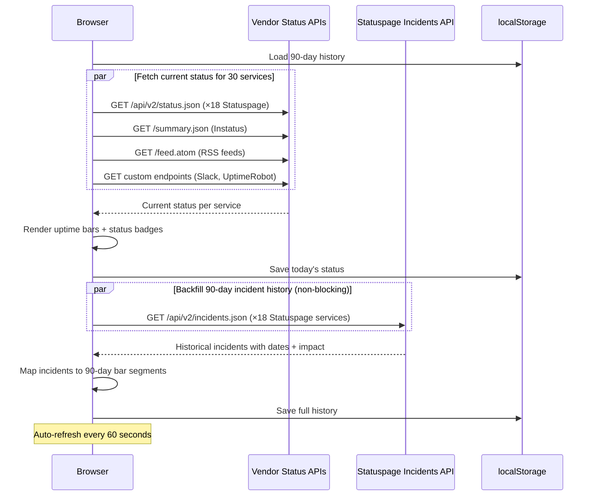
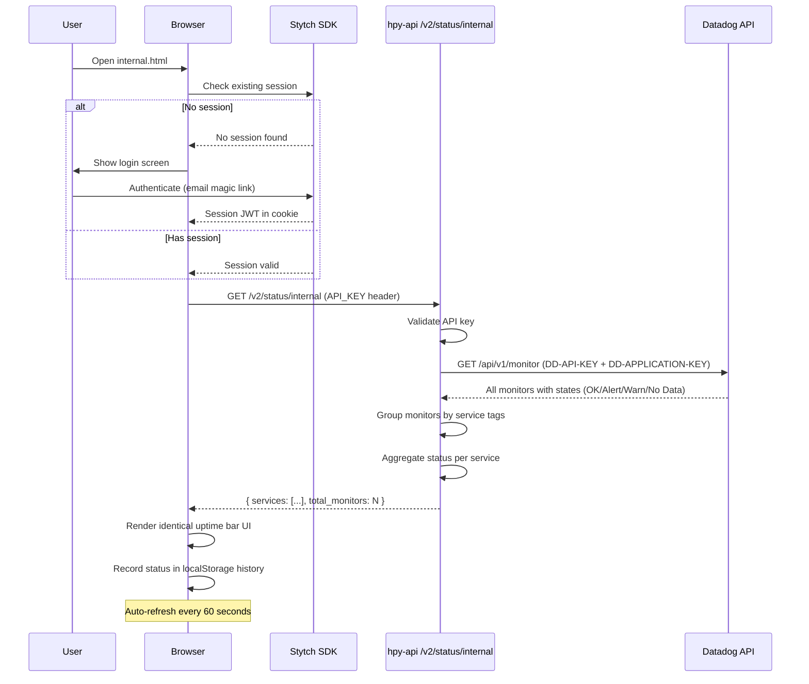
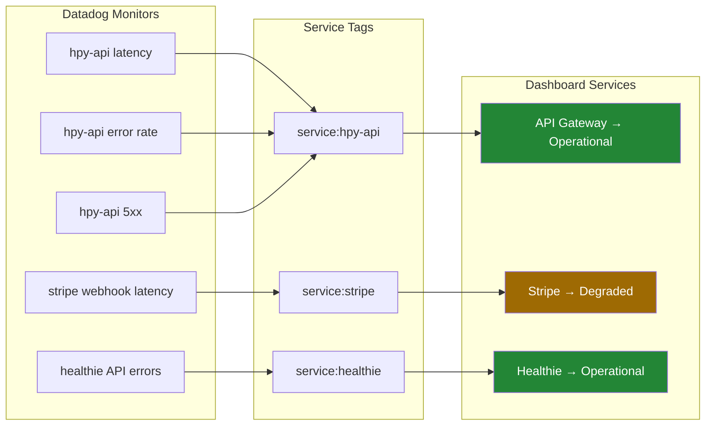

# hpy-uptime

**Live dashboard:** [https://happy-health.github.io/hpy-uptime/](https://happy-health.github.io/hpy-uptime/)

A dependency status dashboard for Happy Health with two views:

- **Public** (`index.html`) — Monitors 30 external service status pages with 90-day uptime bars
- **Internal** (`internal.html`) — Stytch-authenticated view of actual system health from Datadog monitors

## Architecture

### Public status page

Fetches status directly from each vendor's public API in the browser — no backend needed. Services use Statuspage JSON APIs, RSS/Atom feeds, Instatus, UptimeRobot, or custom endpoints. History accumulates in localStorage and is backfilled from Statuspage incident APIs on first load.



### Internal status page (Datadog)

Authenticated page that shows real system health derived from Datadog monitors. Requires a backend (hpy-api) to proxy Datadog API requests and keep API keys server-side.



### Monitor-to-service aggregation



## Services tracked (public page)

### Direct API access (24/30)

| Service | Category | API Type |
|---|---|---|
| GitHub | Source Control | Statuspage |
| Bitbucket | Source Control | Statuspage |
| GitLab | Source Control | RSS feed |
| npm Registry | Package Registries | Statuspage |
| PyPI | Package Registries | Statuspage |
| Shopify | Payments | Statuspage |
| Datadog | Observability | Statuspage |
| Sentry | Observability | Statuspage |
| Mixpanel | Observability | Statuspage |
| Customer.io | Communications | Statuspage |
| Twilio | Communications | Statuspage |
| Slack | Communications | Custom API |
| Segment | Communications | Statuspage |
| Stytch | Authentication | Instatus |
| Candid Health | Healthcare | Statuspage |
| Healthie | Healthcare | Statuspage |
| Supabase | Database | Statuspage |
| Sanity | CMS | Statuspage |
| Oracle Cloud | Cloud & Hosting | RSS feed |
| Cloudflare | Cloud & Hosting | Statuspage |
| Vercel | Cloud & Hosting | Statuspage |
| Inngest | Workflow | Statuspage |
| Eve | Partner | UptimeRobot |
| Athena Health | Healthcare | Manual check |

### Requires CORS proxy (6/30)

| Service | Category | Feed/API |
|---|---|---|
| Stripe | Payments | JSON API |
| PayPal | Payments | Atom feed |
| AWS | Cloud & Hosting | Atom feed |
| Microsoft Azure | Cloud & Hosting | XML feed |
| Google Cloud | Cloud & Hosting | Atom feed |
| Apple Developer | Mobile Platforms | JSONP |

Pass `?proxy=https://your-worker.workers.dev` to enable these.

## Services tracked (internal page)

The internal page maps Datadog monitor tags to logical services:

| Service | Category | Monitor Tags |
|---|---|---|
| API Gateway | Core Platform | `service:hpy-api` |
| API (Enso) | Core Platform | `service:hpy-api-enso` |
| API (CRO) | Core Platform | `service:hpy-api-cro` |
| Stytch Auth | Authentication | `service:stytch` |
| Athena Health | Healthcare | `service:athena` |
| Candid Health | Healthcare | `service:candid` |
| Healthie | Healthcare | `service:healthie` |
| OpenLoop | Healthcare | `service:openloop` |
| Stripe | Payments | `service:stripe` |
| Shopify | Payments | `service:shopify` |
| DynamoDB | Database | `service:dynamodb` |
| Supabase | Database | `service:supabase` |
| Twilio | Communications | `service:twilio` |
| Customer.io | Communications | `service:customerio` |
| Slack | Communications | `service:slack` |
| Datadog | Observability | `service:datadog` |
| Sentry | Observability | `service:sentry` |
| Inngest | Workflow | `service:inngest` |
| AWS Lambda | Infrastructure | `service:aws-lambda` |
| AWS S3 | Infrastructure | `service:aws-s3` |

Add services by editing `SERVICE_DEFINITIONS` in `api/routers/v2/status.py` in hpy-api.

## Setup

### Prerequisites

- **Public page**: No setup needed. Open `index.html` in a browser.
- **Internal page**: Requires hpy-api with the `/v2/status/internal` endpoint deployed, plus a `DD_APP_KEY` in the Datadog secrets group.

### Enable GitHub Pages

An org admin needs to:

1. Go to **https://github.com/organizations/happy-health/settings**
2. Navigate to **Member privileges** > **Pages creation** and enable it
3. In repo settings, select **Deploy from a branch** > **`main`** / **`/ (root)`**

### Deploy CORS proxy (optional)

Unblocks the 6 remaining services on the public page. Free tier: 100K requests/day.

```javascript
// Cloudflare Worker
export default {
  async fetch(request) {
    const url = new URL(request.url);
    const target = url.searchParams.get("url");
    if (!target) return new Response("Missing ?url=", { status: 400 });
    const resp = await fetch(target, {
      headers: { "User-Agent": "hpy-uptime-proxy/1.0" },
    });
    const headers = new Headers(resp.headers);
    headers.set("Access-Control-Allow-Origin", "*");
    return new Response(resp.body, { status: resp.status, headers });
  },
};
```

### Configure internal dashboard

Open `internal.html` with URL parameters:

```
internal.html?api_url=https://your-api-domain.com&api_key=your-key
```

Or with Stytch auth:

```
internal.html?api_url=https://your-api-domain.com&stytch_token=public-token-live-xxx
```

## Adding a new service

### Public page

Edit the `SERVICES` array in `index.html`. For Statuspage services:

```javascript
sp("New Service", "Category", "https://status.example.com",
   "https://status.example.com"),
```

For RSS/Atom feeds:

```javascript
sp("New Service", "Category", "https://status.example.com",
   null, "https://status.example.com/feed.atom", false, "atom"),
```

### Internal page

Add a `ServiceDefinition` to `SERVICE_DEFINITIONS` in `api/routers/v2/status.py`:

```python
ServiceDefinition(
    name="New Service",
    category="Category",
    monitor_tags=["service:new-service"],
),
```

Then tag your Datadog monitors with `service:new-service`.
